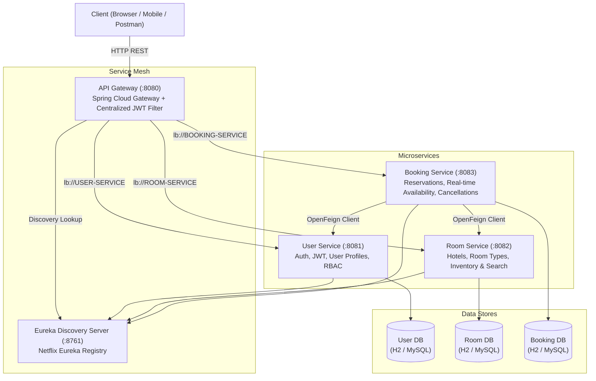

# Starlight Stays & Resorts - Microservices Platform

An enterprise-grade, cloud-native hotel reservation and real-time room inventory management platform built with **Java 17**, **Spring Boot 3.3.4**, and **Spring Cloud 2023.0.3**.

---

## 1. System Architecture



---

| Service | Port | Description | Interactive UI & Documentation |
| :--- | :---: | :--- | :--- |
| **Eureka Server** | `8761` | Service Registry & Discovery | [http://localhost:8761](http://localhost:8761) |
| **API Gateway** | `8080` | Central Reverse Proxy & JWT Auth Filter | **Embedded Web App**: [http://localhost:8080](http://localhost:8080) |
| **User Service** | `8081` | Authentication (JWT), User Profiles & Roles | [Swagger UI](http://localhost:8081/swagger-ui.html) |
| **Room Service** | `8082` | Hotels, Room Categories, Inventory & Search | [Swagger UI](http://localhost:8082/swagger-ui.html) |
| **Booking Service** | `8083` | Real-time Availability & Reservation Lifecycle | [Swagger UI](http://localhost:8083/swagger-ui.html) |

---

## 3. Pre-Seeded Spring Boot Demo Data

On Spring Boot startup, `DataInitializer` components automatically seed the in-memory database:

### Demo User Accounts
* **Guest**: `john_doe` / `Guest123!` (`ROLE_GUEST`)
* **Administrator**: `admin` / `Admin123!` (`ROLE_ADMIN`)
* **Hotel Manager**: `manager` / `Manager123!` (`ROLE_HOTEL_MANAGER`)

### Seeded Luxury Resorts & Suites
1. **Starlight Azure Bay Resort** (Malibu, USA - 5 Stars)
   * *Oceanfront King Villa*: $450.00 / night (10 inventory units)
   * *Executive Family Suite*: $650.00 / night (8 inventory units)
2. **Starlight Alpine Grand** (Aspen, USA - 5 Stars)
   * *Alpine Summit Chalet*: $520.00 / night (12 inventory units)
3. **Starlight Emerald Coast** (Honolulu, USA - 5 Stars)
   * *Royal Penthouse Suite*: $850.00 / night (5 inventory units)

---

## 3. Key Design Patterns & Business Logic

### Centralized JWT Verification & Header Propagation
* Clients send `Authorization: Bearer <token>` to the **API Gateway** (`:8080`).
* Gateway's `AuthenticationFilter` validates the cryptographic signature and token expiration.
* Gateway injects downstream identity headers:
  * `X-User-Id`
  * `X-User-Username`
  * `X-User-Email`
  * `X-User-Roles`
* Downstream services (`Booking Service`, `Room Service`) receive pre-verified user context without redundant authentication overhead.

### Real-Time Room Availability & Overlap Calculation
A room category is available for reservation between `[checkInDate, checkOutDate)` if:
$$\text{Available Rooms} = \text{Total Inventory} - \sum \text{overlapping active bookings} \ge \text{Requested Rooms}$$

* **Overlap Criteria**: An active booking (`CONFIRMED`, `PENDING`, `CHECKED_IN`) overlaps if:
  $$\text{booking.check\_in} < \text{requestedCheckOut} \quad \text{AND} \quad \text{booking.check\_out} > \text{requestedCheckIn}$$
* **Transactional Concurrency**: Concurrency-safe booking methods execute under database transaction isolation to eliminate race conditions and double-bookings.

### Dual-Database Profile Architecture
* **`dev` Profile (Default)**: In-memory **H2** database running with MySQL compatibility mode (`MODE=MySQL`). Allows immediate, zero-friction local execution and automated testing without external dependencies.
* **`prod` Profile**: **MySQL 8.x** with HikariCP connection pooling, configurable via environment variables (`DB_HOST`, `DB_PORT`, `DB_NAME`, `DB_USERNAME`, `DB_PASSWORD`). A complete database script `init-mysql.sql` and `docker-compose.yml` are provided.

---

## 4. Prerequisites & Build

* **Java 17 LTS** (Configured locally at `$USERPROFILE\tools\jdk-17*`)
* **Maven** (Configured locally at `$USERPROFILE\tools\apache-maven-3.9.9` or via `./mvnw.bat` / `./mvnw.ps1`)

### Compile and Run All Tests
```powershell
powershell -ExecutionPolicy Bypass -File .\mvnw.ps1 clean test
```

---

## 5. Starting the Services

You can launch all services in order using the included orchestration script:

```powershell
# Launch all microservices (starts each service in a dedicated console window)
.\run-microservice.ps1 -Service all -Profile dev
```

Or run individual services:
```powershell
.\run-microservice.ps1 -Service eureka
.\run-microservice.ps1 -Service user
.\run-microservice.ps1 -Service room
.\run-microservice.ps1 -Service booking
.\run-microservice.ps1 -Service gateway
```

---

## 6. API Reference & Test Walkthrough

All requests can be routed directly through the **API Gateway at `http://localhost:8080`**.

### Step 1: Register a New Guest
```bash
curl -X POST http://localhost:8080/api/auth/register \
  -H "Content-Type: application/json" \
  -d '{
    "username": "alexguest",
    "email": "alex@starlight.com",
    "password": "SecurePassword123!",
    "firstName": "Alex",
    "lastName": "Rivera",
    "phoneNumber": "+1-555-0192",
    "role": "ROLE_GUEST"
  }'
```

### Step 2: Login and Obtain JWT Token
```bash
curl -X POST http://localhost:8080/api/auth/login \
  -H "Content-Type: application/json" \
  -d '{
    "username": "alexguest",
    "password": "SecurePassword123!"
  }'
```
*Save the returned `token` string for subsequent authenticated calls.*

### Step 3: Fetch Current User Profile
```bash
curl -X GET http://localhost:8080/api/users/me \
  -H "Authorization: Bearer <TOKEN>"
```

### Step 4: Register a Hotel (Manager / Admin)
```bash
curl -X POST http://localhost:8080/api/hotels \
  -H "Authorization: Bearer <TOKEN>" \
  -H "Content-Type: application/json" \
  -d '{
    "name": "Starlight Emerald Coast Resort",
    "description": "Exclusive 5-star beachfront paradise",
    "address": "500 Palm Boulevard",
    "city": "Honolulu",
    "country": "USA",
    "starRating": 5,
    "contactEmail": "aloha@starlightemerald.com",
    "contactPhone": "+1-808-555-0199"
  }'
```

### Step 5: Add a Room Category with Inventory
```bash
curl -X POST http://localhost:8080/api/room-types \
  -H "Authorization: Bearer <TOKEN>" \
  -H "Content-Type: application/json" \
  -d '{
    "hotelId": 1,
    "name": "Oceanfront Penthouse",
    "description": "Top-floor luxury suite with infinity terrace",
    "basePricePerNight": 495.00,
    "maxOccupancy": 4,
    "totalInventory": 5,
    "amenities": "WiFi,Private Pool,Ocean View,King Bed,Breakfast,Butler Service"
  }'
```

### Step 6: Search Rooms (Multi-Criteria Filter)
```bash
curl -X GET "http://localhost:8080/api/rooms/search?city=Honolulu&minPrice=200&maxPrice=600&guests=2&starRating=4" \
  -H "Authorization: Bearer <TOKEN>"
```

### Step 7: Check Real-Time Room Availability
```bash
curl -X POST http://localhost:8080/api/bookings/check-availability \
  -H "Authorization: Bearer <TOKEN>" \
  -H "Content-Type: application/json" \
  -d '{
    "roomTypeId": 1,
    "checkInDate": "2026-10-15",
    "checkOutDate": "2026-10-20"
  }'
```

### Step 8: Create a Hotel Reservation
```bash
curl -X POST http://localhost:8080/api/bookings \
  -H "Authorization: Bearer <TOKEN>" \
  -H "Content-Type: application/json" \
  -d '{
    "hotelId": 1,
    "roomTypeId": 1,
    "checkInDate": "2026-10-15",
    "checkOutDate": "2026-10-20",
    "numRooms": 1,
    "numGuests": 2,
    "specialRequests": "Quiet oceanfront floor please"
  }'
```

### Step 9: View My Bookings
```bash
curl -X GET http://localhost:8080/api/bookings/my-bookings \
  -H "Authorization: Bearer <TOKEN>"
```

### Step 10: Cancel a Reservation
```bash
curl -X POST http://localhost:8080/api/bookings/1/cancel \
  -H "Authorization: Bearer <TOKEN>" \
  -H "Content-Type: application/json" \
  -d '{
    "cancellationReason": "Flight schedule rescheduled"
  }'
```
*(Cancelling immediately restores availability for those dates).*

---

## 7. Production MySQL Deployment

To run with MySQL 8:
```powershell
# 1. Start MySQL container
docker compose up -d

# 2. Run any service with prod profile
.\run-microservice.ps1 -Service all -Profile prod
```
